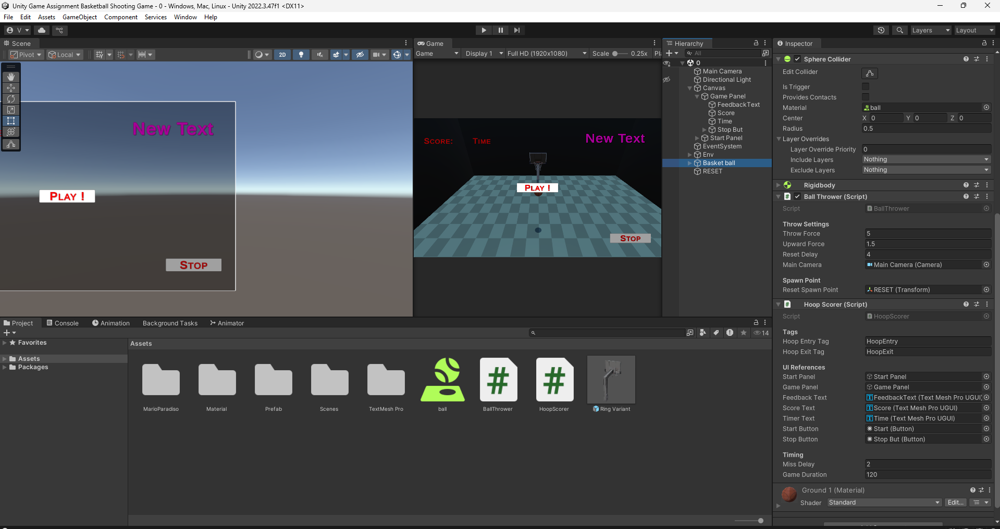
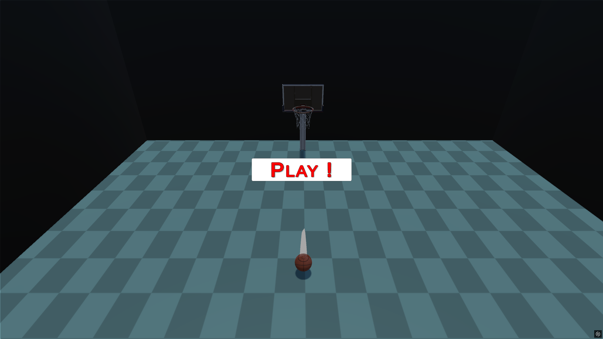
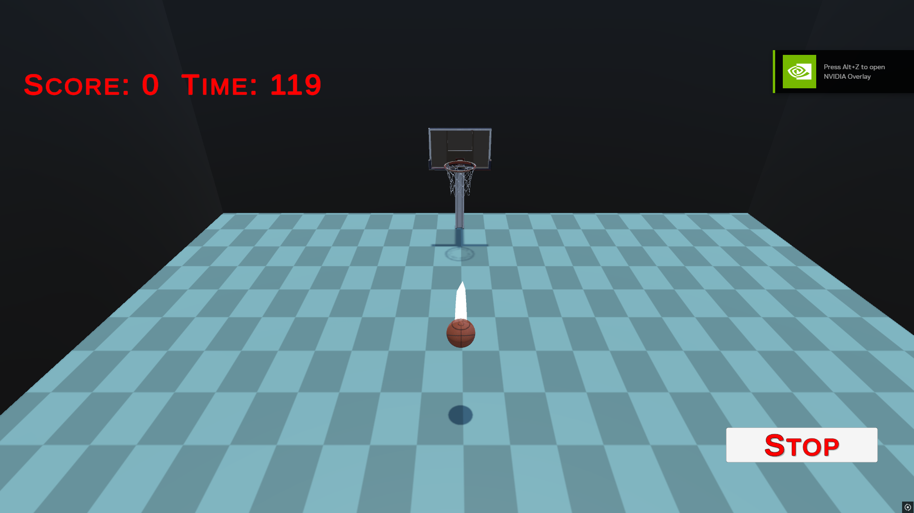
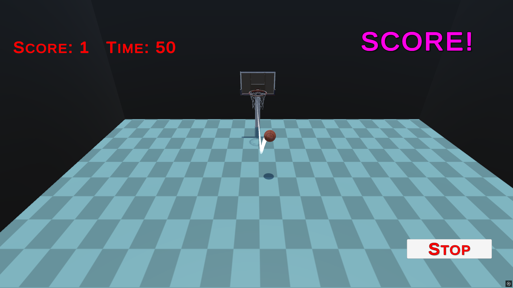
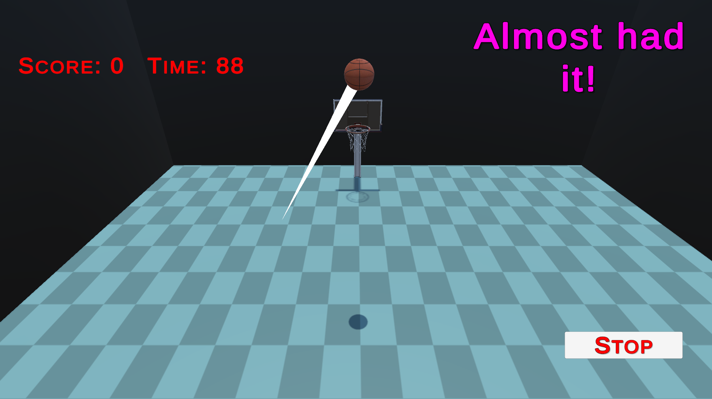

# 🏀 Unity-Game-Assignment-Basketball-Shooting-Game

A basketball-style arcade minigame made with Unity. Swipe to throw the ball and try to score through the hoop before time runs out!


## 📌 Project Info

- **Name**: Unity-Game-Assignment-Basketball-Shooting-Game  
- **Engine**: Unity  
- **Version**: 2021.3 LTS or later  
- **Status**: Playable  
- **Tags**: Unity, Game, Basketball, Swipe, Arcade, 3D


## 🚀 How to Run

1. **Clone the Repository**  
   ```bash
   git clone https://github.com/vishwajeetfate/Unity-Game-Assignment-Basketball-Shooting-Game.git


## 🛠 How to Open in Unity Hub

1. **Click "Add Project"** and select the cloned folder  
2. **Use Unity 2021.3 LTS or later**


## ▶️ Play the Game

1. Open the **MainScene** (or the main gameplay scene)  
2. Press the **Play** button in the Unity Editor


## 🎮 Controls

### Mouse / Touch
- Click and drag (or swipe) to aim  
- Release to throw the ball

### UI Buttons
- **Start Game**: Begins the 2-minute game session  
- **Stop Game**: Ends the current game early

---

## 📁 Project Structure

### 🔧 Scripts

#### `BallThrower.cs`
- Detects mouse/touch input  
- Calculates throw direction and force  
- Resets ball position after throw

#### `HoopScorer.cs`
- Detects ball entry and exit through hoop  
- Displays feedback messages  
- Updates score and timer


### 🖥 UI

#### Panels
- **Start Panel**: Visible before the game starts  
- **Game Panel**: Shows score, time, and feedback

#### Components
- **TextMeshPro UI** for displaying score and timer  
- **Buttons** for starting and stopping the game


## 📸 Screenshots

|  |    |
|------------------------------------|--------------------------------------|  
|  |    |
|------------------------------------|--------------------------------------|  
|  |                                   


## 🎞 Gameplay Videos

| 📽 **Unity Editor View (GIF)** | 📽 **Build File View (GIF)** |
|------------------------------------|--------------------------------------|  
|  |  |


## ❤️ Footer

Made with ❤️ in Unity


